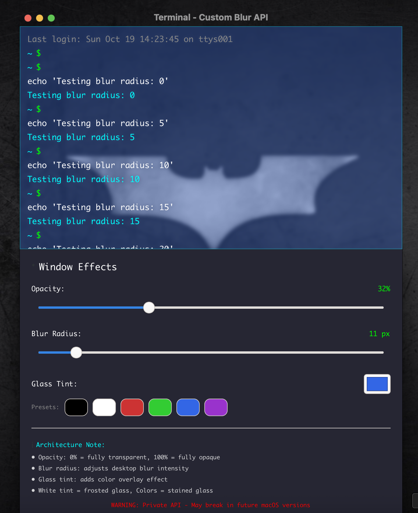

# Rust GTK macOS App with Native Blur Effects

A cross-platform terminal application built in **Rust** that demonstrates native library integration for advanced window effects. Currently implemented for macOS with plans for Linux and Windows support.

## 🎯 Project Purpose

This project serves as a learning platform for understanding **Rust-native library communication**. The primary goals are:

- **macOS**: Master Objective-C/Swift bridge development and private API integration
- **Linux**: Explore X11/Wayland native window management and compositing
- **Windows**: Implement DWM (Desktop Window Manager) API integration

## 💡 Implementation Journey & Challenges

### The Road to Native Blur Effects

This project represents the culmination of extensive research and experimentation with macOS native APIs. The journey began with a **100% native SwiftUI prototype** ([TerminalPrototypeApp](https://github.com/hugomf/TerminalPrototypeApp)) where we learned:

#### 🔍 Initial Research Phase
- **Deep dive into macOS private APIs** - Understanding WindowServer and CoreGraphics frameworks
- **Reverse engineering** existing applications with blur effects (Terminal, Finder)
- **API discovery** through system monitoring and header file analysis
- **SwiftUI limitations** - Realizing native frameworks require AppKit/Cocoa bridging

#### 🛠️ Technical Challenges Overcome

**1. Private API Integration**
```objc
// Challenge: Accessing undocumented WindowServer functions
extern OSStatus CGSSetWindowBackgroundBlurRadius(int window_id, int radius);
extern int CGSMainConnectionID(void);
```
- **Solution**: Custom Objective-C bridge with careful memory management
- **Risk**: APIs may break with macOS updates (notarized apps may be rejected)

**2. Cross-Language Communication**
```rust
// Challenge: Rust ↔ Objective-C interoperability
unsafe extern "C" {
    fn macos_blur_init() -> i32;
    fn macos_blur_apply_to_gtk_window(window: *mut gtk4::ffi::GtkWindow, radius: u32) -> i32;
}
```
- **Solution**: FFI (Foreign Function Interface) with proper type bridging
- **Struggle**: Memory management across language boundaries

**3. GTK4 Window Integration**
- **Challenge**: Applying macOS-specific effects to cross-platform GTK windows
- **Solution**: Window handle extraction and native API bridging
- **Complexity**: Coordinating GTK event loop with native macOS calls

#### 🎯 Key Learning Milestones

**Week 1-2: Foundation Building**
- Understanding macOS window composition system
- Learning Objective-C runtime and message passing
- Exploring existing open-source blur implementations

**Week 3-4: Bridge Development**
- Creating stable Rust ↔ Objective-C communication layer
- Handling GTK4 window lifecycle with native effects
- Debugging memory management issues across languages

**Week 5-6: Polish & Refinement**
- Real-time parameter adjustment implementation
- Color tint and opacity synchronization
- Performance optimization and error handling

#### 🚧 Ongoing Challenges

**API Stability**
- Private APIs evolve with macOS versions
- Need for continuous testing across macOS releases
- Risk mitigation through fallback mechanisms

**Cross-Platform Vision**
- Each platform requires completely different approaches
- Linux: Wayland vs X11 fragmentation
- Windows: DWM API versioning complexity

**Performance Considerations**
- Balancing visual effects with system responsiveness
- Memory usage optimization for real-time updates
- Battery life impact on portable Macs

## 🚀 Features

### Current (macOS)
- **Window Blur Effects**: Real-time adjustable blur radius using private macOS APIs
- **Glass Tint Controls**: Color overlay effects with preset colors
- **Opacity Management**: Adjustable window transparency
- **GTK4 Interface**: Modern, responsive UI with terminal-style aesthetics
- **Native Bridge**: Direct communication between Rust and Objective-C

### 📸 Application Preview



*The application showcases real-time window blur effects with adjustable opacity, blur radius, and glass tint controls.*

### Technical Architecture

```
┌─────────────────┐    ┌──────────────────┐    ┌─────────────────┐
│   Rust GTK4 UI  │◄──►│  Native Bridge   │◄──►│  macOS APIs     │
│   (main.rs)     │    │  (macos_bridge.m)│    │  (WindowServer) │
└─────────────────┘    └──────────────────┘    └─────────────────┘
```

## 🏗️ Project Structure

```
macos-term/
├── src/
│   └── main.rs              # GTK4 UI and application logic
├── macos_bridge.m           # Objective-C bridge for native APIs
├── build.rs                 # Build script for compiling bridge
├── Cargo.toml              # Rust dependencies and configuration
└── README.md               # This file
```

## 🛠️ Dependencies

### Rust Crates
- `gtk4` - GUI framework
- `cocoa` - macOS bindings
- `objc2` - Objective-C runtime
- `glib` - GNOME base library

### Build Dependencies
- `cc` - C/C++ compiler integration

## 🔧 Building and Running

### Prerequisites
- **macOS** with Xcode command line tools
- **Rust** (latest stable)
- **GTK4** development libraries

### Build Steps
```bash
# Clone the repository
git clone <repository-url>
cd macos-term

# Build the project
cargo build --release

# Run the application
cargo run
```

## 🎮 Usage

1. **Opacity Control**: Adjust window transparency (0-100%)
2. **Blur Radius**: Control background blur intensity (0-100px)
3. **Glass Tint**: Apply color overlays for different visual effects
4. **Presets**: Quick color selection (Black, White, Red, Green, Blue, Purple)

## 🏗️ Development Roadmap

### Phase 1: macOS (Current)
- ✅ Basic window blur implementation
- ✅ Color tint effects
- ✅ GTK4 integration
- 🔄 Documentation and cleanup

### Phase 2: Linux (Planned)
- 🔄 X11 window management research
- ⏳ Wayland compositing integration
- ⏳ KDE KWin effects API
- ⏳ GNOME Shell extensions

### Phase 3: Windows (Future)
- ⏳ DWM API integration
- ⏳ Acrylic effects implementation
- ⏳ Win32 native bridge development

## 🔍 Technical Learning Objectives

### Native Library Communication
- **FFI (Foreign Function Interface)** patterns
- **Memory management** across language boundaries
- **Error handling** in cross-language contexts
- **Build system integration** for mixed-language projects

### Platform-Specific Challenges
- **macOS**: Private API stability and App Store compatibility
- **Linux**: Desktop environment fragmentation (GNOME/KDE/XFCE)
- **Windows**: DWM API versioning and Windows 10/11 differences

## 🤝 Contributing

This is a learning project! Contributions, suggestions, and questions are welcome:

1. **Issues**: Report bugs or request features
2. **Discussions**: Share ideas for cross-platform implementation
3. **Pull Requests**: Submit improvements or platform ports

## ⚠️ Important Notes

### macOS Private APIs
- Uses private macOS APIs that may break in future versions
- Not suitable for App Store distribution
- Intended for educational purposes only

### Cross-Platform Considerations
- Each platform requires different approaches to window effects
- API availability and stability vary significantly
- Performance characteristics differ across platforms

## 📚 Resources

- [Rust FFI Guide](https://doc.rust-lang.org/nomicon/ffi.html)
- [macOS Window Management](https://developer.apple.com/documentation/appkit/nswindow)
- [GTK4 Documentation](https://gtk-rs.org/gtk4-rs/stable/latest/docs/gtk4/)
- [Wayland Protocols](https://wayland.freedesktop.org/docs/)

## 📄 License

This project is for educational purposes. See license file for details.

---

**Built with ❤️ using Rust and native platform APIs**
